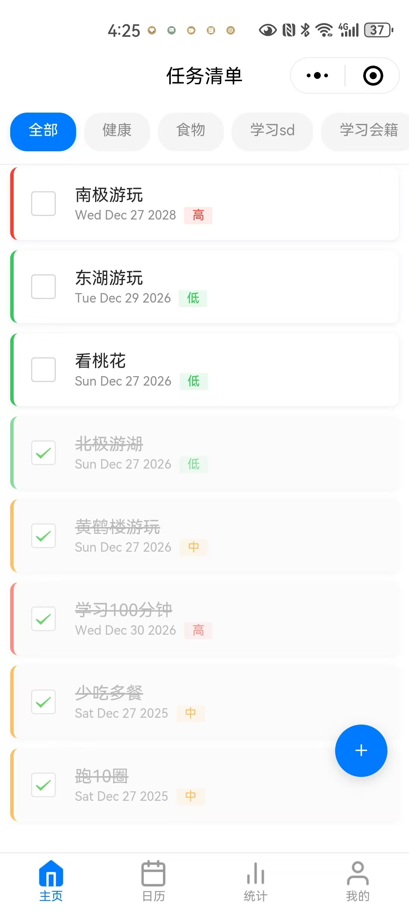
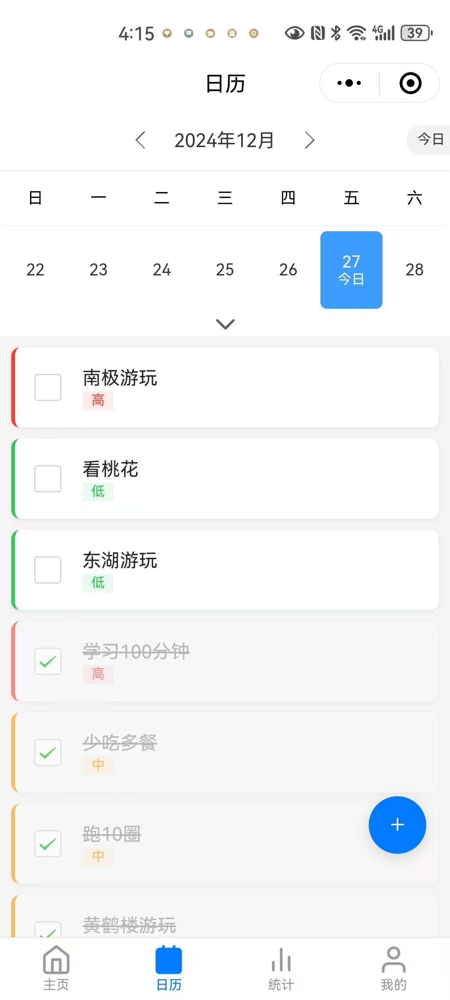
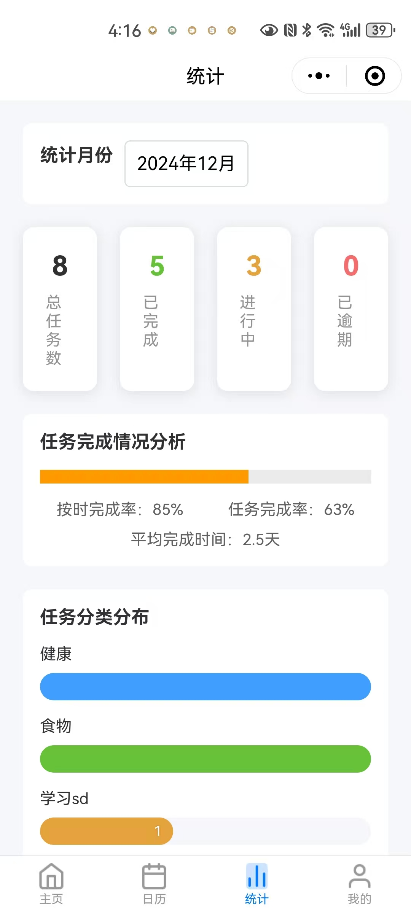
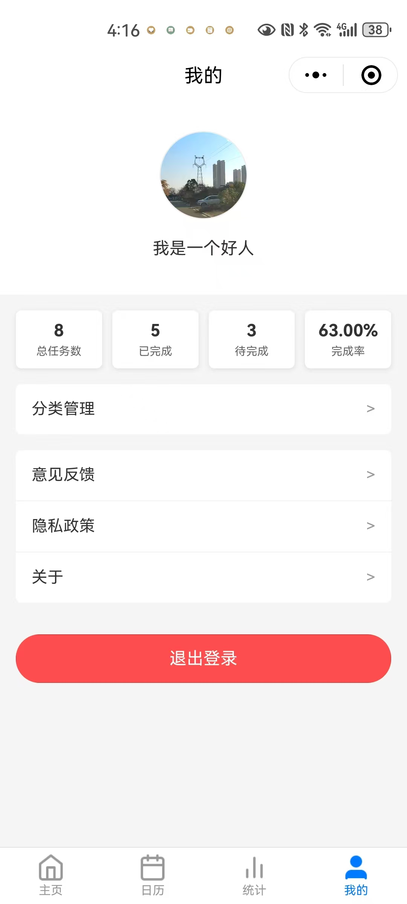

# Todo Application | Todo 应用

[English](#english) | [中文](#chinese)

<div id="english">

# Todo Application

A modern, full-stack todo application built with Vue.js 3 and Django REST Framework.

## 📱 Screenshots

<div style="display: flex; justify-content: space-between;">
    
    
    
    
</div>

## 🏗️ Architecture

### Frontend (`todoApp`)
- **Framework**: Vue.js 3
- **State Management**: Pinia with persistence
- **UI Components**: uni-ui
- **Charts**: uCharts
- **Styling**: SASS

### Backend (`todoServer`)
- **Framework**: Django + Django REST Framework
- **Authentication**: OAuth2 + JWT
- **Real-time Features**: Channels (WebSocket)
- **Task Queue**: Celery
- **Cache**: Redis
- **Documentation**: DRF Spectacular, Swagger/OpenAPI
- **Database**: SQLite (Development) / PostgreSQL (Production)

## ✨ Features

- User authentication and authorization
- Task CRUD operations
- Real-time notifications
- Task statistics and analytics
- Activity stream
- File attachments
- Mobile-responsive design
- Data persistence
- Task history tracking

## 🚀 Getting Started

### Frontend Setup

1. Install dependencies:
```bash
cd todoApp
npm install
```

2. Run development server:
```bash
npm run dev
```

### Backend Setup

1. Create and activate virtual environment:
```bash
cd todoServer
python -m venv venv
source venv/bin/activate  # On Windows: venv\Scripts\activate
```

2. Install dependencies:
```bash
pip install -r requirements.txt
```

3. Run migrations:
```bash
python manage.py migrate
```

4. Start development server:
```bash
python manage.py runserver
```

## 🐳 Docker Support

The application includes Docker support for easy deployment:

```bash
docker-compose up --build
```

## 📦 Tech Stack

### Frontend Dependencies
- @dcloudio/uni-ui: ^1.5.7
- @qiun/ucharts: ^2.5.0
- pinia: ^2.0.0
- vue: ^3.2.45
- sass/sass-loader for styling

### Backend Dependencies
- Django 5.0
- Django REST Framework
- Channels for WebSocket
- Celery for async tasks
- Redis for caching
- OAuth2 + JWT for authentication
- Various Django utilities (activity-stream, cors-headers, etc.)

## 🔐 Environment Variables

Backend environment variables should be configured in `.env` file:
- Database settings
- Redis configuration
- OAuth2 credentials
- JWT settings
- Email configuration

## 📝 API Documentation

API documentation is available through Swagger/OpenAPI:
- Development: http://localhost:8000/api/schema/swagger-ui/
- Production: https://your-domain/api/schema/swagger-ui/

## 🤝 Contributing

1. Fork the repository
2. Create your feature branch
3. Commit your changes
4. Push to the branch
5. Create a Pull Request

## 📄 License

This project is licensed under the MIT License.

</div>

<div id="chinese">

# Todo 应用

一个使用 Vue.js 3 和 Django REST Framework 构建的现代全栈待办事项应用。

## 📱 应用截图

<div style="display: flex; justify-content: space-between;">
    
    
    
    
</div>

## 🏗️ 架构

### 前端 (`todoApp`)
- **框架**: Vue.js 3
- **状态管理**: Pinia（支持持久化）
- **UI组件**: uni-ui
- **图表**: uCharts
- **样式**: SASS

### 后端 (`todoServer`)
- **框架**: Django + Django REST Framework
- **认证**: OAuth2 + JWT
- **实时功能**: Channels (WebSocket)
- **任务队列**: Celery
- **缓存**: Redis
- **文档**: DRF Spectacular, Swagger/OpenAPI
- **数据库**: SQLite (开发环境) / PostgreSQL (生产环境)

## ✨ 功能特性

- 用户认证和授权
- 任务的增删改查操作
- 实时通知
- 任务统计和分析
- 活动流
- 文件附件
- 移动端响应式设计
- 数据持久化
- 任务历史追踪

## 🚀 快速开始

### 前端设置

1. 安装依赖:
```bash
cd todoApp
npm install
```

2. 运行开发服务器:
```bash
npm run dev
```

### 后端设置

1. 创建并激活虚拟环境:
```bash
cd todoServer
python -m venv venv
source venv/bin/activate  # Windows系统: venv\Scripts\activate
```

2. 安装依赖:
```bash
pip install -r requirements.txt
```

3. 运行数据库迁移:
```bash
python manage.py migrate
```

4. 启动开发服务器:
```bash
python manage.py runserver
```

## 🐳 Docker 支持

应用包含 Docker 支持，便于部署：

```bash
docker-compose up --build
```

## 📦 技术栈

### 前端依赖
- @dcloudio/uni-ui: ^1.5.7
- @qiun/ucharts: ^2.5.0
- pinia: ^2.0.0
- vue: ^3.2.45
- sass/sass-loader 用于样式处理

### 后端依赖
- Django 5.0
- Django REST Framework
- Channels 用于 WebSocket
- Celery 用于异步任务
- Redis 用于缓存
- OAuth2 + JWT 用于认证
- 各种 Django 工具（activity-stream, cors-headers 等）

## 🔐 环境变量

后端环境变量需要在 `.env` 文件中配置：
- 数据库设置
- Redis 配置
- OAuth2 凭证
- JWT 设置
- 邮件配置

## 📝 API 文档

API 文档通过 Swagger/OpenAPI 提供：
- 开发环境: http://localhost:8000/api/schema/swagger-ui/
- 生产环境: https://your-domain/api/schema/swagger-ui/

## 🤝 贡献指南

1. Fork 本仓库
2. 创建特性分支
3. 提交更改
4. 推送到分支
5. 创建 Pull Request

## 📄 许可证

本项目采用 MIT 许可证。

</div>
